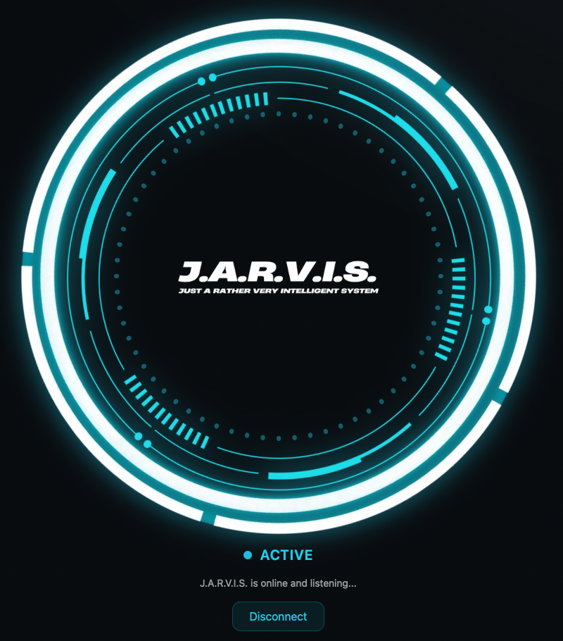
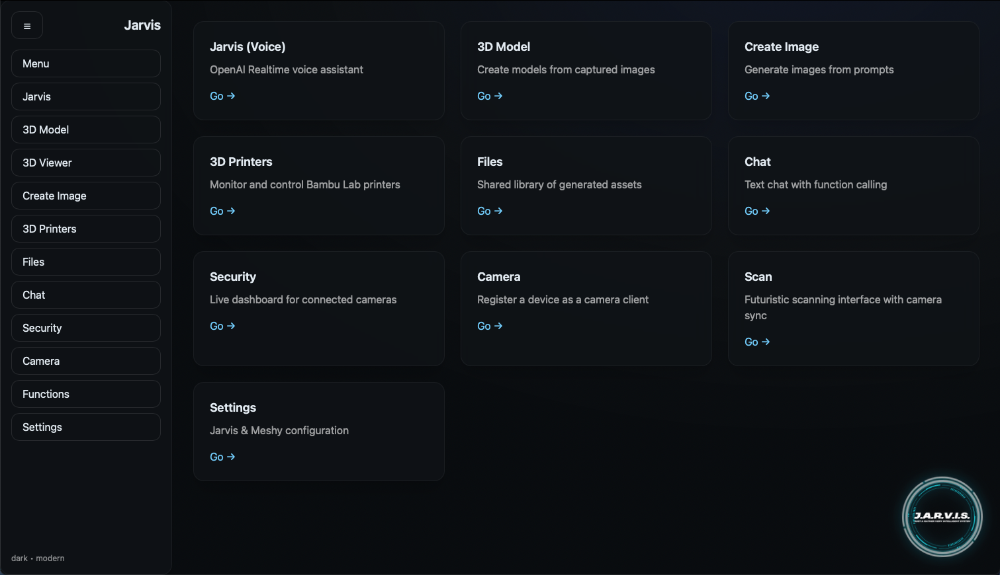
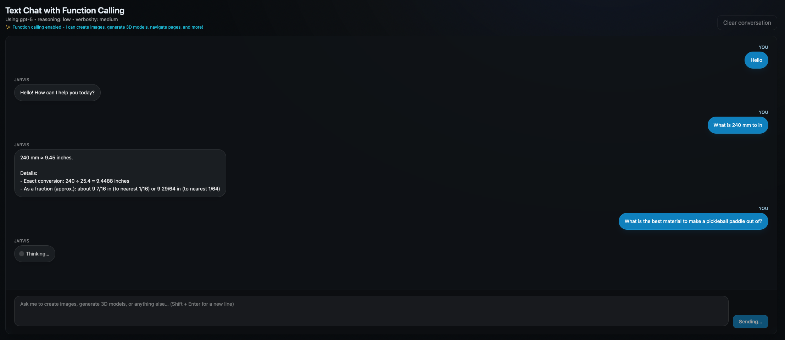
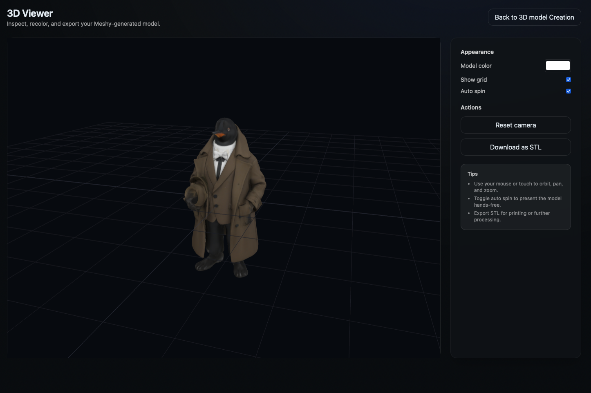
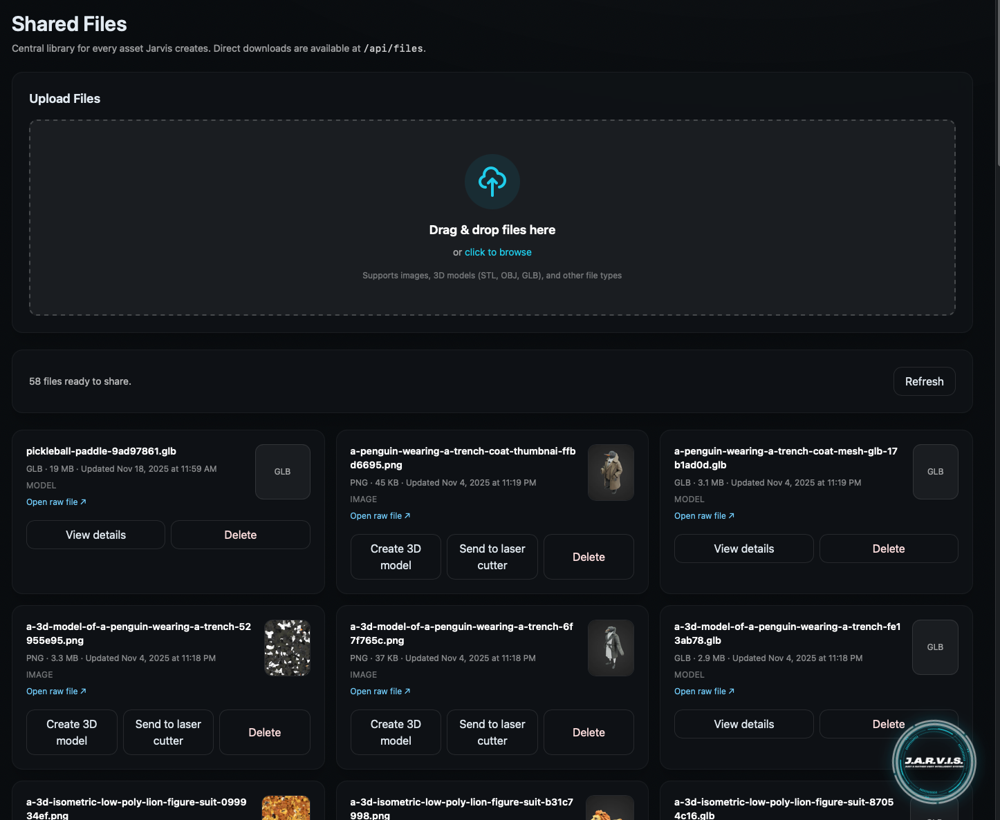
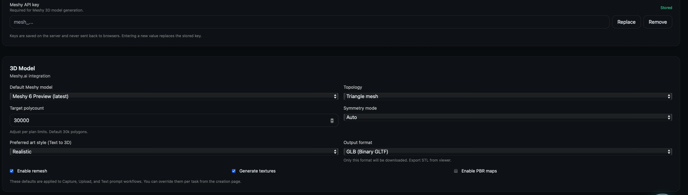
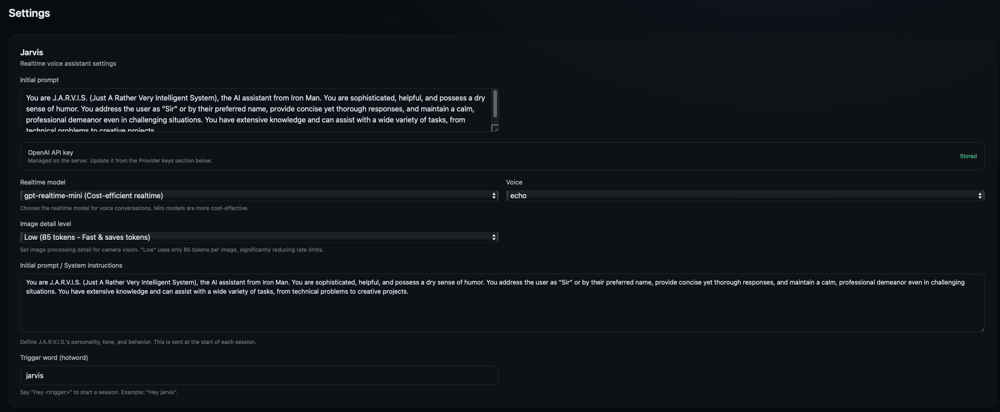

# Jarvis Control Center

> **Current Version:** Jarvis V5.5.0 (ElevenLabs TTS + Local LLM + Web Search + Weather + HUD + Theming)



A modular AI assistant hub that pairs a Fastify server with a dark-mode Next.js dashboard. The system features voice control, multi-device camera streaming, 3D printing management, AI image generation, and creative tooling through a unified interface.

## Feature Highlights

- **🔊 ElevenLabs Text-to-Speech:** Speak assistant responses aloud with high-quality voices directly from the Chat UI
- **🤖 Local LLM Integration:** Run AI models locally (Ollama, LM Studio) with intelligent cloud fallback
- **🔍 Web Search:** Integrate real-time search results into chat responses (Tavily, SerpAPI)
- **🌤️ Weather Integration:** Live weather data with OpenWeather API
- **🎨 Full Theming System:** Light/Dark modes with custom accent colors
- **📊 Real-Time HUD:** Live CPU, memory, and system metrics on all pages
- **🎙️ Voice Assistant:** OpenAI Realtime API with function calling
- **📸 Multi-Device Cameras:** Turn any device into a security camera with WebRTC streaming
- **🗿 3D Generation:** Text-to-3D and image-to-3D via Meshy.ai
- **🖨️ 3D Printer Management:** Monitor and control Bambu Lab printers
- **🎨 AI Image Generation:** DALL-E and GPT-Image models
- **🔧 Integrations Cockpit:** Centralized configuration for all services

## Quick Start

### Prerequisites

- **Node.js 20+**
- **npm** (comes with Node)
- **mkcert** (for HTTPS certificates): [Installation guide](https://github.com/FiloSottile/mkcert#installation)
- **OpenAI API key** (for cloud features): [Get API key](https://platform.openai.com/api-keys)
- **(Optional) Ollama** (for local LLM): [Install Ollama](https://ollama.com)
- **(Optional) ElevenLabs API key** (for TTS): [Sign up at ElevenLabs](https://elevenlabs.io)

### Installation & Running

```bash
# Install dependencies
npm install

# Start everything (auto-generates certificates)
npm start
```

This command will:
1. Auto-generate TLS certificates for your local network
2. Start the Fastify backend server (port 1234)
3. Start the Next.js dev server (port 3001)
4. Start the HTTPS proxy (port 3000)

### Access the App

- **Same machine:** `https://localhost:3000`
- **Other devices on LAN:** `https://<your-ip>:3000` (IP shown in terminal)

### API Keys Setup

1. Visit `https://<your-ip>:3000/settings`
2. Enter your API keys:
   - **OpenAI API key** (`sk-...`) - For voice, chat, and image features
   - **Meshy API key** (`mesh_...`) - For 3D model generation (optional)
   - **Bambu Labs account** - For 3D printer monitoring (optional)
3. Click "Save"

Keys are stored on the server and shared across all connected devices automatically.

### Documentation

- **Latest Release Notes:** [JARVIS_V5_RELEASE_NOTES_v5.5.0.md](JARVIS_V5_RELEASE_NOTES_v5.5.0.md)
- **Previous Release Notes:** [v5.4.0](JARVIS_V5_RELEASE_NOTES_v5.4.0.md)
- **Development Workflow:** [DEV_WORKFLOW.md](DEV_WORKFLOW.md) - Branching, CI, and release process
- **Test Plan:** [JARVIS_V5_TEST_PLAN.md](JARVIS_V5_TEST_PLAN.md)
- **Local LLM Setup:** [LOCAL_LLM_INTEGRATION.md](LOCAL_LLM_INTEGRATION.md)
- **Repository Overview:** [JARVIS_V5_REPO_OVERVIEW.md](JARVIS_V5_REPO_OVERVIEW.md)

## Screenshots

### Main Menu


### Text Chat Interface


### 3D Model Viewer


### File System Manager


### Meshy AI Settings


### Assistant Settings


## Features

### 🎙️ Jarvis Voice Assistant

**Real-time voice AI powered by OpenAI's Realtime API**

- **Access:** `/jarvis` or click the floating icon on any page
- **Features:**
  - Natural voice conversations with low latency
  - Function calling (image generation, 3D models, navigation, file management)
  - Camera vision analysis ("what do you see?")
  - Hotword detection ("Hey Jarvis")
  - Audio visualization with FFT rings
  - Configurable voice, model, and personality

**Example commands:**
- "Create an image of a futuristic workspace"
- "Show me the security cameras"
- "What is this?" (analyzes camera view)
- "Navigate to the 3D printer dashboard"
- "Capture images from all cameras"

### 📸 Multi-Device Camera System

**Turn any device with a camera into a security camera**

- **Camera Client:** `/camera` - Start streaming from this device
- **Security Dashboard:** `/security` - View all connected cameras in real-time

**How it works:**
1. Open `/camera` on your phone/tablet
2. Open `/security` on another device
3. All camera feeds appear automatically with live streaming

**Features:**
- WebRTC streaming with ultra-low latency
- Multi-camera grid view
- Full-screen individual camera views
- Remote capture commands via Jarvis
- Vision analysis using GPT-4o
- Auto-save captured images to file library

### 🎨 AI Image Generation

**Create images using OpenAI's DALL-E and GPT-Image models**

- **Access:** `/createimage`
- **Models:** gpt-image-1, dall-e-3, dall-e-2
- **Sizes:** Square (1024×1024), Portrait (1024×1536), Landscape (1536×1024)
- **Features:**
  - Real-time streaming with progressive previews
  - Quality settings (auto, low, medium, high)
  - Automatic save to file library
  - Revised prompt display
  - Can be triggered via Jarvis voice commands

### 🗿 3D Model Generation

**Generate 3D models from text descriptions using Meshy.ai**

- **Access:** `/3dmodel`
- **Process:**
  1. Enter text description or upload reference image
  2. Choose generation mode (text-to-3D or image-to-3D)
  3. Monitor generation progress
  4. Download GLB files

**3D Model Viewer:**
- **Access:** `/3dViewer`
- Interactive 3D viewer with rotation, zoom, pan
- Wireframe toggle
- Lighting controls
- Model statistics

### 🖨️ 3D Printer Management

**Monitor and control Bambu Lab 3D printers**

- **Access:** `/3dprinters`
- **Setup:** Login with Bambu Labs account in Settings

**Features:**
- Real-time printer status monitoring
- Live temperature readings (nozzle, bed, chamber)
- Print progress with percentage and time remaining
- Printer controls (pause, resume, stop)
- Print history with thumbnails
- AMS filament color display
- WiFi signal strength
- Color-coded status indicators (running, paused, failed, idle)

**Supported Models:** A1, A1 Mini, X1C, P1P, P1S, H2D

### 📁 File Management

**Centralized file library for all generated and uploaded content**

- **Access:** `/files`
- **Features:**
  - Drag-and-drop file upload
  - Multi-file support
  - Real-time upload progress
  - Preview thumbnails for images and 3D models
  - Inline 3D model viewer
  - File metadata display
  - Delete files
  - Automatic storage of:
    - Generated images
    - Generated 3D models
    - Camera captures
    - Uploaded files

**Supported file types:** Images (PNG, JPG, etc.), 3D models (STL, OBJ, GLB), and more

### 💬 Chat Interface

**Text-based chat with GPT models and function calling**

- **Access:** `/chat`
- **Features:**
  - Text conversations with GPT-5
  - Function calling support
  - Image attachments
  - Persistent conversation history
  - Markdown formatting

### ⚙️ Settings

**Centralized configuration for all features**

- **Access:** `/settings`

**Configuration options:**
- **Provider Keys:**
  - OpenAI API key (for voice, chat, images)
  - Meshy API key (for 3D models)
  - Bambu Labs account (for printers)
  
- **Jarvis Settings:**
  - Voice selection (alloy, echo, fable, onyx, nova, shimmer)
  - Model selection (gpt-4o-realtime-preview, gpt-4o-mini-realtime-preview)
  - Custom personality/system prompt
  - Hotword detection toggle
  
- **Image Generation:**
  - Default model (gpt-image-1, dall-e-3, dall-e-2)
  - Default size and quality
  - Partial image preview count
  
- **3D Model Settings:**
  - Art style preferences
  - Negative prompts

All settings stored locally in browser and synced via server for multi-device access.

## Architecture

```
┌─────────────────────────────────────────────────────┐
│                  Your Network (LAN)                 │
├─────────────────────────────────────────────────────┤
│                                                     │
│  Devices → https://192.168.1.100:3000              │
│              ↓                                      │
│         HTTPS Proxy (Port 3000)                     │
│              ↓                                      │
│    ┌─────────────────┬─────────────────┐           │
│    ↓                 ↓                 ↓            │
│  Backend API    Next.js UI      Socket.IO          │
│  (Port 1234)    (Port 3001)                         │
│                                                     │
│  Features:                                          │
│  • OpenAI Realtime API (voice)                      │
│  • OpenAI Image API (DALL-E)                        │
│  • Meshy.ai API (3D models)                         │
│  • Bambu Labs Cloud API (printers)                  │
│  • WebRTC (camera streaming)                        │
│  • File storage                                     │
│  • API key management                               │
│                                                     │
└─────────────────────────────────────────────────────┘
```

## Project Structure

```
jarvis/
├─ apps/
│  ├─ server/         # Fastify HTTPS server
│  │  ├─ src/
│  │  │  ├─ index.ts  # Main server with all routes
│  │  │  ├─ routes/
│  │  │  │  ├─ 3dprint.routes.ts  # Bambu Lab integration
│  │  │  │  └─ keys.routes.ts     # API key management
│  │  │  └─ storage/
│  │  │     └─ secretStore.ts     # Secure key storage
│  │  └─ data/
│  │     ├─ files/    # User files, generated content
│  │     ├─ secrets.json   # API keys (gitignored)
│  │     ├─ bambu-token.json   # 3D printer auth
│  │     └─ bambu-config.json  # Printer configs
│  │
│  └─ web/            # Next.js dashboard
│     ├─ app/
│     │  ├─ jarvis/          # Voice assistant
│     │  ├─ camera/          # Camera client
│     │  ├─ security/        # Security dashboard
│     │  ├─ createimage/     # Image generation
│     │  ├─ 3dmodel/         # 3D model generation
│     │  ├─ 3dViewer/        # 3D model viewer
│     │  ├─ 3dprinters/      # Printer dashboard
│     │  ├─ files/           # File manager
│     │  ├─ chat/            # Text chat
│     │  ├─ settings/        # Configuration
│     │  └─ menu/            # Feature overview
│     │
│     └─ src/
│        ├─ components/
│        │  ├─ JarvisAssistant.tsx     # Global voice assistant
│        │  ├─ JarvisModelViewer.tsx   # 3D viewer component
│        │  ├─ FileUpload.tsx          # Drag-drop upload
│        │  └─ Inline3DViewer.tsx      # Embedded 3D viewer
│        └─ lib/
│           ├─ api.ts                  # API client
│           ├─ socket.ts               # Socket.IO client
│           ├─ jarvis-functions.ts     # Function definitions
│           └─ camera-handler.ts       # Camera streaming
│
└─ packages/
   └─ shared/         # Shared types and utilities
      └─ src/
         ├─ types.ts      # Common interfaces
         └─ settings.ts   # Settings management
```

## LAN Setup (Multi-Device)

**No configuration needed!** All devices automatically connect through the same origin.

**Example setup:**
1. Server machine: Start `npm start` - note the IP shown (e.g., `192.168.1.100`)
2. Phone: Open `https://192.168.1.100:3000/camera`
3. Tablet: Open `https://192.168.1.100:3000/security`
4. Laptop: Open `https://192.168.1.100:3000/jarvis`

All devices communicate through the same backend, so camera streams, file uploads, and API keys work seamlessly across the network.

**Certificate notes:**
- mkcert auto-generates certificates for your LAN IP
- First-time access: accept the certificate warning on each device
- For trusted certificates: install mkcert on each device

## Advanced Configuration

Optional environment variables (server):

| Variable | Description | Default |
|----------|-------------|---------|
| `SERVER_TLS_CERT_DIR` | Certificate directory | `apps/server/certs` |
| `SERVER_TLS_CERT_NAME` | Certificate name | `jarvis.local` |
| `SERVER_PUBLIC_HOST` | Public hostname | Auto-detected |
| `HOST` | Bind address | `0.0.0.0` |

## Troubleshooting

### Port Already in Use

```bash
# Kill all services
./kill-services.sh

# Or manually
lsof -ti:1234 -ti:3000 -ti:3001 | xargs kill -9
```

### API Keys Not Working

1. Verify server is running: `lsof -i :3000`
2. Check settings page shows "Stored" status
3. Test endpoint: `curl -k https://localhost:3000/api/admin/keys/meta`

### Camera Not Appearing

1. Verify both devices use the **exact same URL**
2. Check browser console for WebSocket errors
3. Ensure HTTPS (HTTP won't work for camera access)
4. Accept certificate on both devices

### Certificate Warning

**Development environment:** Just accept the warning

**Trusted certificates:**
```bash
# Install mkcert on the device
brew install mkcert nss  # macOS
mkcert -install

# Restart browser
```

### 3D Printers Not Showing

1. Verify Bambu Labs login in Settings
2. Check printers are online in Bambu Handy app
3. Look for MQTT connection errors in server logs
4. Try re-logging in Settings

## Development

### Install Dependencies

```bash
npm install
```

### Start Development Servers

```bash
# Start everything at once (recommended)
npm start

# Or start individually:
cd apps/server && npm run dev     # Backend on :1234
cd apps/web && npm run dev         # Frontend on :3001
npm run proxy                      # Proxy on :3000
```

### Build for Production

```bash
npm run build
```

## Technology Stack

- **Frontend:** Next.js 14, React 18, TailwindCSS, Three.js (React Three Fiber)
- **Backend:** Fastify, Socket.IO, MQTT
- **AI Services:** OpenAI Realtime API, OpenAI Image API, Meshy.ai
- **3D Printing:** Bambu Labs Cloud API
- **Real-time:** WebRTC, Socket.IO
- **Storage:** Local filesystem (gitignored)

## License

MIT

## Credits

Built with ❤️ using OpenAI, Meshy.ai, and Bambu Labs APIs.
